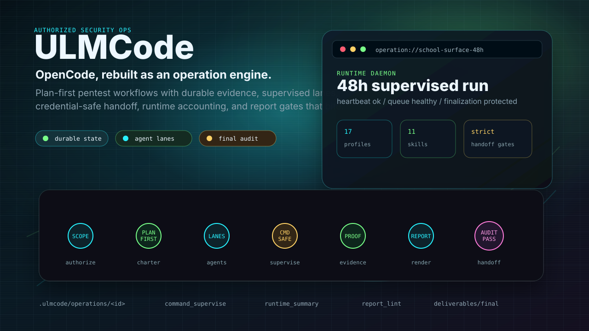
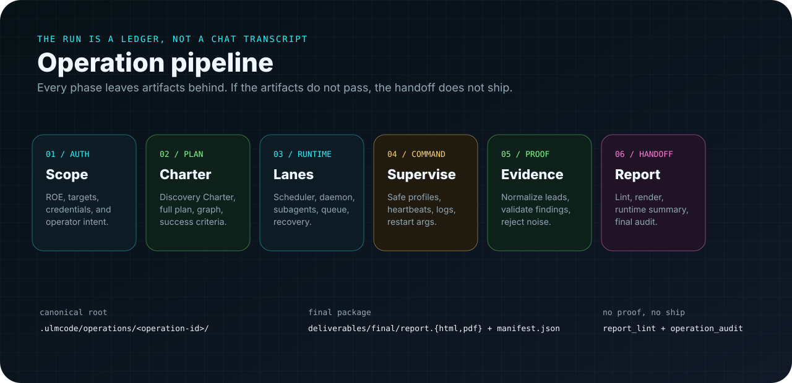
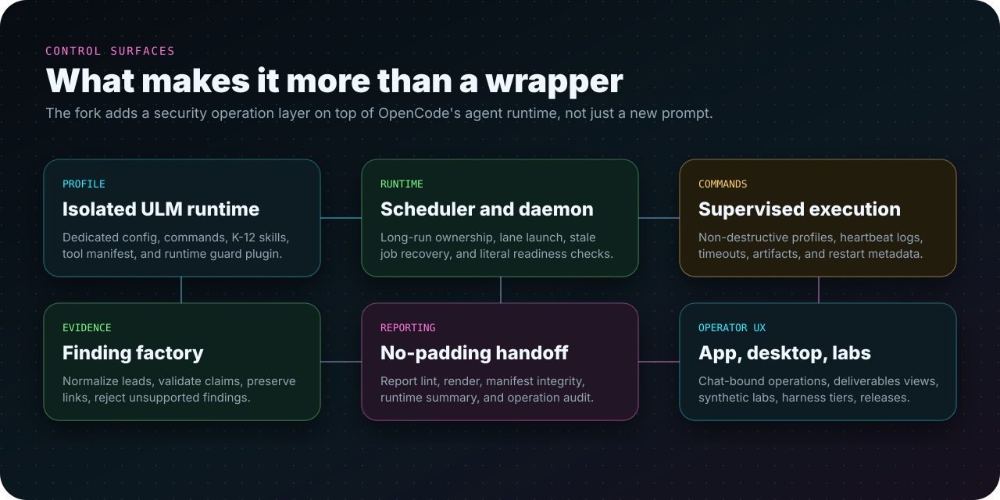

<p align="center">
  
</p>

<p align="center">
  <a href="https://github.com/trevor050/ulmcode/actions/workflows/ulm-harness.yml">
    
  </a>
  <a href="https://github.com/trevor050/ulmcode/actions/workflows/ulmcode-release-cli.yml">
    
  </a>
  <a href="./LICENSE">
    
  </a>
  
</p>

# ULMCode

**ULMCode is an OpenCode fork for guided, authorized security operations.** It turns an agent chat into an operation system: plans become durable artifacts, long work runs through supervised lanes, evidence is normalized before it becomes a finding, and final reports must pass strict gates before handoff.

This is not a prompt pack. It is a security operations layer for OpenCode.

## The Product Bet

<p align="center">
  
</p>

Most agentic pentest demos fail in the middle. They can narrate a scan, but they lose context, blur evidence, block on shell commands, overclaim findings, or produce reports that look like filler.

ULMCode makes the operation itself the source of truth.

| Instead of...        | ULMCode does this                                                                                                             |
| -------------------- | ----------------------------------------------------------------------------------------------------------------------------- |
| Chat-only plans      | Writes operation goals, Discovery Charters, full plans, schedules, checkpoints, and audits under `.ulmcode/operations/<id>/`. |
| One giant agent loop | Uses scheduler-owned lanes, background tasks, supervised commands, specialist agents, and restartable daemon runs.            |
| Findings from vibes  | Requires evidence references, validation state, normalized leads, and rejection paths for unsupported claims.                 |
| Thin final answers   | Generates a final package with HTML, PDF, manifest, findings JSON, evidence index, runtime summary, and operation audit.      |
| "Trust me, it ran"   | Stores heartbeats, command artifacts, cost/context accounting, stale-job metadata, and final gate results.                    |

## Operation Pipeline

<p align="center">
  
</p>

The closeout is intentionally strict. A final answer is not a deliverable. A deliverable is a generated package with evidence links, parseable structured files, runtime accounting, and a fresh passing audit.

## Capability Map

<p align="center">
  
</p>

## What Lives Where

| Path                    | Purpose                                                                                                     |
| ----------------------- | ----------------------------------------------------------------------------------------------------------- |
| `packages/opencode`     | Core CLI/server/runtime, ULM tools, operation artifacts, agents, scheduler, daemon, report pipeline, tests. |
| `packages/app`          | Solid app UI, operation dashboards, chat-bound ULM panels, deliverables and credential views.               |
| `packages/desktop`      | Electron desktop shell and packaging for the ULMCode app.                                                   |
| `tools/ulmcode-profile` | Isolated ULM profile, compact skills, commands, guard plugin, model defaults, and tool manifest.            |
| `tools/ulmcode-labs`    | Manifest-driven synthetic vulnerable labs and replay targets.                                               |
| `tools/ulmcode-evals`   | Versioned harness scenarios for capability checks.                                                          |
| `docs/ulm-autonomy`     | Architecture decisions for long-running operations, evidence factories, report gates, and model governance. |

## Final Handoff Package

`deliverables/final/` is the human handoff folder generated from canonical operation artifacts.

| Artifact                       | Why it matters                                                     |
| ------------------------------ | ------------------------------------------------------------------ |
| `report.pdf` and `report.html` | Stakeholder-ready report and styled source render.                 |
| `findings.json`                | Structured validated/reportable findings.                          |
| `evidence-index.json`          | Evidence references and reverse links.                             |
| `executive-summary.md`         | Leadership-ready summary.                                          |
| `technical-appendix.md`        | Implementation details, validation notes, and remediation context. |
| `operator-review.md`           | Internal operator handoff, limitations, and review notes.          |
| `runtime-summary.md`           | Model, cost, compaction, task, and blind-spot accounting.          |
| `manifest.json`                | Canonical file inventory and integrity anchor.                     |

Report gates reject sparse reports, stale generated files, unsupported findings, placeholder padding, missing runtime summaries, manifest drift, and credentialed plans without a submitted redacted credential review.

## Quick Start

```bash
bun install
bun run dev          # ULM CLI/runtime
bun run dev:web      # web app
bun run dev:desktop  # desktop app
```

Install and verify the isolated ULM profile:

```bash
tools/ulmcode-profile/scripts/install-profile.sh
tools/ulmcode-profile/test-profile.sh
```

The root `test` script intentionally exits early. Use package-level checks from the package you are changing.

## ULM Commands Worth Knowing

```bash
# Fast lifecycle smoke test
bun run --cwd packages/opencode test:ulm-smoke

# Profile skills and supervised command manifest
bun run --cwd packages/opencode test:ulm-skills
bun run --cwd packages/opencode test:ulm-tool-manifest

# Synthetic lab replay and target services
bun run --cwd packages/opencode test:ulm-lab
bun run --cwd packages/opencode test:ulm-lab-target

# Harness tiers
bun run --cwd packages/opencode test:ulm-harness:fast
bun run --cwd packages/opencode test:ulm-harness:chaos

# Long-run owner
bun run --cwd packages/opencode ulm:runtime-daemon <operationID> --duration-hours 20 --detach --json

# Literal readiness after daemon work
bun run --cwd packages/opencode ulm:literal-run-readiness <operationID> --strict --json
```

## Safety Model

ULMCode is built for scoped, authorized work.

- Unattended command profiles default to `non_destructive`.
- Commands expected to exceed two minutes should run through `command_supervise`, background tasks, the scheduler, or the daemon.
- Authorized credentials belong in `operation_credentials`; raw secrets should not appear in chat, operation memory, reports, command text, task metadata, or final deliverables.
- Findings are not report-ready until they have evidence references and validation state.
- K-12 people and organization recon must stay professional, scoped, and engagement-relevant.

## Model And Profile Defaults

The ULM profile is intentionally isolated from a general OpenCode setup.

- Default operation agent: `pentest`
- Focused one-off mode: `action`
- Primary reasoning/reporting route: `openai/gpt-5.5`
- Quick recon/evidence route: `openai/gpt-5.4-mini-fast`
- Bundled profile surfaces: compact K-12 security skills, ULM commands, runtime guard plugin, and tool manifest
- Excluded from the ULM profile by design: personal OpenCode agents, unrelated MCPs, broad model-routing plugins, and the Claude Code bridge plugin

## Verification Matrix

| Check                          | Command                                                                                                         |
| ------------------------------ | --------------------------------------------------------------------------------------------------------------- |
| Core typecheck                 | `bun run --cwd packages/opencode typecheck`                                                                     |
| ULM lifecycle smoke            | `bun run --cwd packages/opencode test:ulm-smoke`                                                                |
| Tool manifest                  | `bun run --cwd packages/opencode test:ulm-tool-manifest`                                                        |
| Profile skills                 | `bun run --cwd packages/opencode test:ulm-skills`                                                               |
| Synthetic labs                 | `bun run --cwd packages/opencode test:ulm-lab`                                                                  |
| Lab target services            | `bun run --cwd packages/opencode test:ulm-lab-target`                                                           |
| Fast harness                   | `bun run --cwd packages/opencode test:ulm-harness:fast`                                                         |
| Full/chaos/overnight harnesses | `bun run --cwd packages/opencode test:ulm-harness:full`, `test:ulm-harness:chaos`, `test:ulm-harness:overnight` |
| Profile installer              | `tools/ulmcode-profile/test-profile.sh`                                                                         |

GitHub runs the fast ULM harness on pull requests and `dev` pushes, with a scheduled chaos lane for deeper drift detection.

## Relationship To OpenCode

ULMCode is a customized fork of [OpenCode](https://github.com/anomalyco/opencode). It keeps the OpenCode client/server architecture, TUI/app foundation, provider integrations, and development ergonomics, then adds ULM-specific security operation workflows on top.

Some package names, internal paths, and upstream localized README files still use OpenCode naming. The canonical ULM-facing README is this file.

## Releases

The repository includes a ULM release workflow for CLI assets, profile skill bundles, Homebrew tap publishing, and desktop packages:

```text
.github/workflows/ulmcode-release-cli.yml
```

For local fork builds, the updater can be pointed at this repository:

```bash
ULMCODE_GITHUB_REPO=trevor050/ulmcode ulmcode upgrade
```

## Contributing

Good contributions preserve the operation contract:

- Keep operation truth in durable artifacts.
- Add or update tests for new ULM tools, routes, report gates, or scheduler behavior.
- Prefer structured outputs over parsing human text where tools support it.
- Run package-level checks from the package you changed.
- Update the nearest `AGENTS.md` only when future agents genuinely need the lesson.

Start with [CONTRIBUTING.md](./CONTRIBUTING.md), then read [AGENTS.md](./AGENTS.md) before making repo-wide changes.

## License

ULMCode is licensed under the [PolyForm Noncommercial License 1.0.0](./LICENSE).

Commercial use, resale, or offering paid services using this software requires a separate written commercial license from the licensor.
